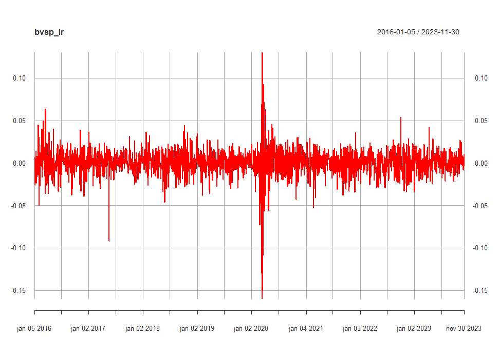
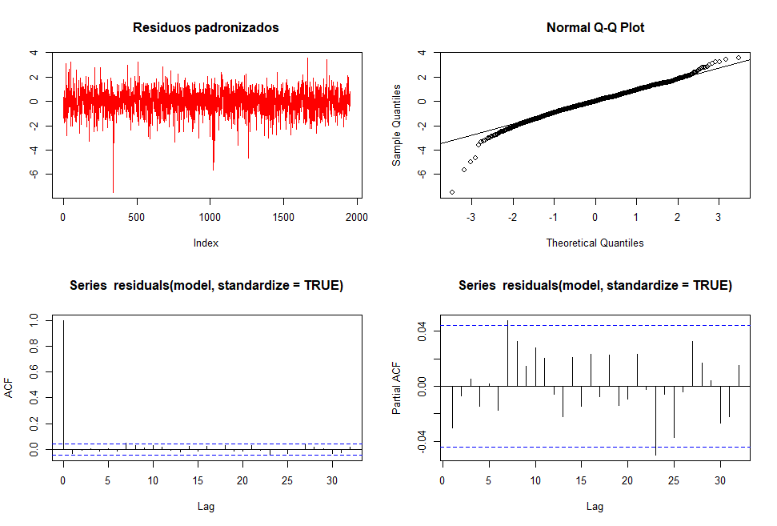
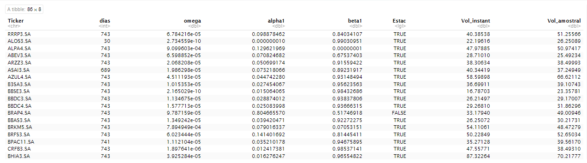
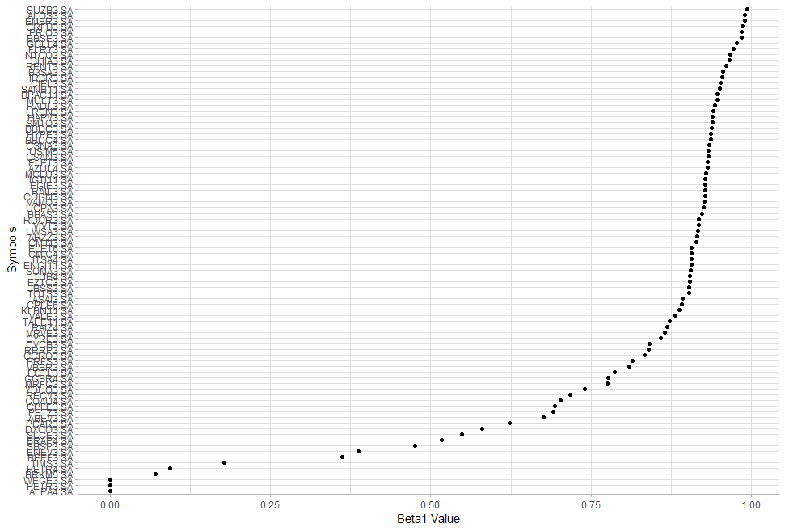

[](https://www.linkedin.com/in/felipe-borges-45400415b/)
[](https://www.r-project.org/)


## Estrutura do repositório

O repositório está estruturado da seguinte forma:

```
├── base dados
├── imagens
├── R Markdown

```

- Na pasta `base dados` estão os dados utilizados no projeto. O arquivo `IBOVDia_04-12-23.csv` é o dataset utilizado. 
- Na pasta `imagens` estão as imagens utilizadas neste README.
- Na pasta `R Markdown` estão os notebooks com o desenvolvimento do projeto. Em detalhes, temos:
  - [`projeto_previsao_series_temporais.ipynb`](file:///C:/Users/feborges/OneDrive/%C3%81rea%20de%20Trabalho/R/R%20Markdown/projeto_volatilidade_IBOVESPA.html): projeto completo
 
 
 

# Calculando a Volatilidade das ações do IBOVESPA

Este repositório documenta um projeto detalhado de análise de heterocedasticidade condicional, onde foi aplicado o modelo GARCH (Generalized Autoregressive Conditional Heteroskedasticity) para modelar esses clusters de volatilidade que as ações do IBOVESPA apresentam. O foco foi calcular a volatilidade instantanea de cada ação, e analisar pressupostos importantes dos resíduos, como estacionariedade, ausência de autocorrelações na série, bem como no quadrado da série e também a normalidade. Para a normalidade, foi utilizado testes formais de Jarque-Bera e Shapiro-Wilk, bem como análises visuais. Outra análise importante foi sobre a influencia da volatilidade passada ma volatilidade atual, analisando o beta1 do modelo GARCH.
Os parametros do modelo GARCH foram ajustados para os dados do log_return do IBOVESPA. Esses mesmos parâmetros se mantiveram para todas as ações, o GARCH(1,1). 




<p align="center"> 
  <a href="https://www.linkedin.com/in/felipe-borges-45400415b/" target="_blank"></a> 
</p>

## Desafio Principal
Uma questão crítica deste projeto é rodar o modelo com os mesmos parâmetros para todas as ações, afinal, muitas tem um histórico recente na carteira do IBOVESPA, não possuindo assim uma série temporal longa o suficiente para o modelo conseguir captar a heterocedasticidade condicional.


## Objetivos 
O objetivo principal deste projeto é calcular a volatilidade instantanea, mas também entender os impactos dos choques recentes na volatilidade, bem como o impacto da persistencia da volatilidade passada na atual.

## Relevância e Aplicabilidade 
Além de fornecer insights sobre o cálculo da volatilidade ao enfatizar a diferença do cálculo de volatilidade "comum" e o calculado pelo GARCH, podemos observar como a volatilidade passada afeta a volatilidade atual. Ao fazer essa leitura e entender esse comportamento, podemos aplicar esse insights no cálculo de risco de um portfólio, bem como eventualmente prevermos a volatilade de períodos a frente.


## Visão Geral do Projeto

### 1- Importação de Dados
Inicialmente, importei os dados do IBOVESPA através da função `getSymbols` do pacote `quantmod`, puxando do Yahoo Finance.
Para conseguir a composição do IBOVESPA atualizada, com todas as ações, eu baixei o csv com a composição do índice, direto da B3:
[Link original- B3](https://www.b3.com.br/pt_br/market-data-e-indices/indices/indices-amplos/indice-ibovespa-ibovespa-composicao-da-carteira.htm)

### 2- Análise Exploratória de Dados (EDA)
Conduzi uma EDA abrangente para investigar as características fundamentais dos dados. Esta etapa inclui a visualização da série temporal e a realização de análises estatísticas descritivas.

### 3- Pré-processamento de Dados
Nesta fase, preparei os dados para a modelagem. Garanti que as séries temporais estejam em um formato adequado para análise subsequente.

### 4- Construção do Modelo SARIMA
Aqui, defini os parâmetros para o modelo GARCH. Esta escolha é foi feita com base nos resultados obtidos nos dados do log_return do IBOVESPA.

### 5- Avaliação do Modelo
Foi avaliado o desempenho do modelo GARCH analisando os resíduos produzidos após o modelo. Fora feitos testes formais, como o Ljung-Box para autocorrelação, Jarque-Bera e Shapiro-Wilk para normalidade, Teste de Significância dos Coeficientes, bem como análises visuais.



### 6- Visualização dos cálculos
Foi apresentado o cálculo de vol e os coeficientes de cada ação.




### 7- Conclusões   
Finalizamos com uma análise dos parâmetros beta de todas as ações analisadas, e com isso pudemos identidicar alguns papéis que geraram beta1 muito baixo, mostrando a necessidade de análise individial de cada caso. Beta1 < 0.5 é um possível problema ao rodar o modelo. Aqui entendemos o comportamento padrão e deixamos como pontos de melhoria futura, uma nova modelagem, específica para essas poucas ações, bem como realizar previsões de volatilidade para os papéis.




